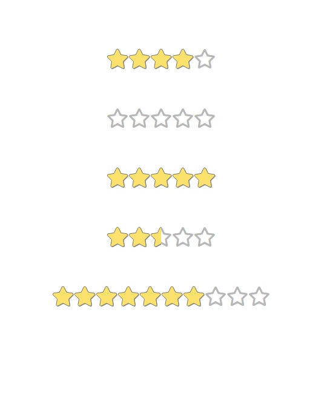

# Deprecated

## component was moved to repository [here](https://github.com/Matej-ch/editable-form-elements)

### Star rating

Requires vue.js 3 , go to branch v2 for previous version

This is simple star rating component

Requires icon of star, here using Fontawesome

**Usage**

```html
<StarRating  :rating=7 :max-stars=10 :step=1 update-msg="Rating destroyed"/>
```

`rating` current rating

`max-stars` number of stars in rating

`step` what is the step, that user can use for rating

`update-msg` message on rating update

